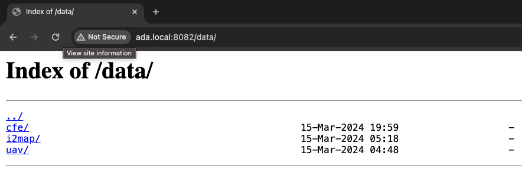

# Development Guide

Setup a development server to run tests on your local machine with the following steps.

# 1.  Setup a [Tator](https://tator.io/) system
 
Installation instructions are in [database_setup.md](tests/docs/database_setup.md)

# 2. Launch Nginx to serve images
```shell
docker stop nginx_images
docker rm nginx_images
docker run -d -p 8082:8082  \
    -v $PWD/tests/data/:/data  \
    -v $PWD/tests/nginx.conf:/etc/nginx/conf.d/default.conf \
    --restart always  \
    --name nginx_images nginx:1.23.3
```

What you should see when you navigate to [http://localhost:8082/data](http://localhost:8082/data) is a list of images that are served from the `tests/data` directory. 
This is useful for testing the image serving capabilities of the module.  



# 3. Launch a REDIS server with the password *aidata*


```shell
docker volume create redis-test
docker run -d -v redis-test:/data --name redis-server -p 6379:6379 -e REDIS_ARGS="--requirepass aidata" redis/redis-stack-server:latest
```

TODO: add instructions for running the tests