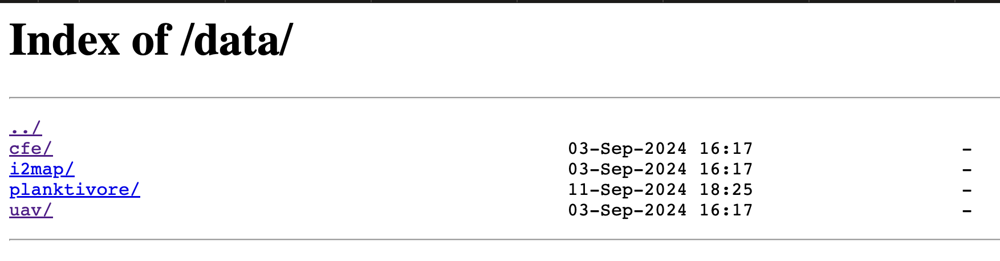

# Test/Development Setup

Setup a development server to run tests on your local machine with the following steps.

# Requirements
- [Docker](https://docs.docker.com/get-docker/)
- [Just](https://github.com/casey/just)
- Python 3.10 or higher

# 1. Check out the repository and install the Anaconda environment
```shell
git clone http://github.com/mbari-org/aidata.git
cd mbari_aidata
conda env create 
conda activate mbari_aidata
export PYTHONPATH=$PWD
```

# 2. Launch a Tator stack
Instructions are in [database_setup.md](docs/database_setup.md)

# 3. Setup the remaining services
This will setup the remaining services needed for development, including a REDIS and NGINX server.
```shell
cd mbari_aidata
just setup-docker-dev #or follow the instructions in the Justfile setup-docker-dev recipe if you don't have Just installed
```
 
What you should see when you navigate to [http://localhost:8082/data](http://localhost:8082/data) is a list of images that are served from the `tests/data` directory. 
This is useful for testing the image serving capabilities of the module.  


 
```