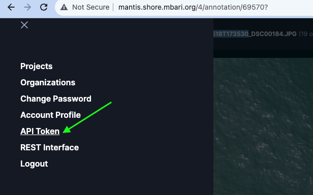

[](http://www.mbari.org)
[](https://www.python.org/downloads/)

*aidata* is a command line tool to do basic extract, transform, load and download operations
on AI data for a number of projects at MBARI that require detection, clustering or classification
workflows.
 
This supports loading [sdcat](https://github.com/mbari-org/sdcat) formatted output and downloads from [Tator](https://www.tatorapp.com/) databases, although
support for other data sources is also possible, e.g. [FathomNet](https://fathomnet.org/).
so we decided to keep the name generic.

## Installation 

### Create the Anaconda environment

The fastest way to get started is to use the Anaconda environment.  This will create a conda environment called *aidata*.
```shell
git clone http://github.com/mbari-org/aidata.git
cd aidata
conda env create 
conda activate aidata
export PYTHONPATH=$PWD
```

A docker version is also available at mbari/aidata, but that is a WIP.

## Commands

* [`aidata download --help` - Download data to COCO, CIFAR, or PASCAL VOC format](docs/commands/download.md) 
* [`aidata load --help` - Load SDCAT formatted data or images from a directory/URL](docs/commands/load.md)
* `aidata -h` - Print help message and exit.

## Setup

### Set your Tator token in an environment variable *or* pass it as an option with --token

```
export TATOR_TOKEN=15afoobaryouraccesstoken
```




Choose your configuration file for the project, e.g. `config/config_cfe.yml`.
Adjust if needed, e.g. to point to the correct mount point for the data
on your local machine.  This is used to check the data before loading and
to create a correct URL for reference in the database.

```yaml
mounts:
  - name: "image"
    path: "/Volumes/CFElab"
    host: "192.168.0.17" # or a hostname 
    ...
```