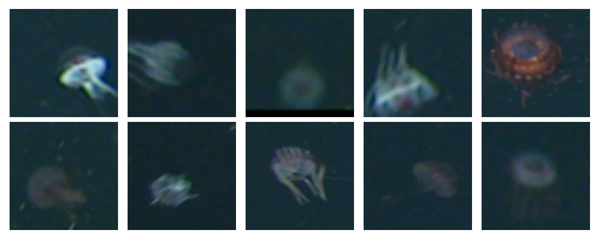

[](http://www.mbari.org)
[](https://www.python.org/downloads/)

*aidata* is a command line tool to do basic extract, transform, load and download operations
on ai data for a number of projects at MBARI that require detection or classification
workflows.

This is a work in progress and more operations will be added as needed.
This supports [sdcat](https://github.com/mbari-org/sdcat) formatted output
and downloads from [Tator](https://www.tatorapp.com/) databases, although
support for other data sources is also possible, e.g. [FathomNet](https://fathomnet.org/).
so we decided to keep the name generic.

## Installation 

### Create the Anaconda environment

The fastest way to get started is to use the Anaconda environment.  This will create a conda environment called *aidata*.
```shell
git clone http://github.com/mbari-org/aidata.git
cd aidata
conda env create 
conda activate aidata
export PYTHONPATH=$PWD
```
 

## Commands

* `aidata download --help` - Download data to COCO, CIFAR, or PASCAL VOC format
* `aidata load --help` - Load SDCAT formatted data or images
* `aidata -h` - Print help message and exit.

  
## Usage

### Set your Tator token in an environment variable or pass it as an option with --token

```
export TATOR_TOKEN=15afoobaryouraccesstoken
```


Choose your configuration file for the project, e.g. `config/config_cfe.yml`.
Adjust if needed, e.g. to point to the correct mount point for the data.

```
mounts:
  - name: "image"
    path: "/Volumes/CFElab"
    host: "192.168.0.17" # or a hostname 
    ...
```

Images need to be loaded before SDCAT csv files, e.g. 

```text
python aidata load images --token $TATOR_TOKEN --config config/config_cfe.yml --input /Volumes/CFElab/2021-07-01/ --section 2021/07
```

### TIP
Add the --dry-run to load without actually loading
```text
python aidata load images  --token $TATOR_TOKEN --config config/config_cfe.yml --input /Volumes/CFElab/2021-07-01/ --dry-run --section 2021/07
```

then load the SDCAT csv files, e.g.

```text
python aidata load boxes --token $TATOR_TOKEN --config config/config_cfe.yml --input /Volumes/CFElab/2021-07-01/ --version Baseline
```

## 
Each command has a number of options.  For example, the `load` command has the following options:

```shell
Usage: aidata load boxes [OPTIONS]

  Load boxes from a directory with SDCAT formatted CSV files

Options:
  --token TEXT       [required]
  --config PATH      Path to a YAML file with project configuration
                     [required]
  --dry-run          Dry run, do not load data
  --version TEXT     Version to load data into. Default is 'Baseline'
  --input TEXT       input CSV file or path with CSV detection files to load
  --max-num INTEGER  Maximum number of images to load
  -h, --help         Show this message and exit.
```

## Data Download

Data can be downloaded in various formats, e.g. COCO, CIFAR, or PASCAL VOC.  The type of download
depends on the model.

Be sure to have a solid internet connection and enough disk space to download the data.

*If your leave off the labels option*, the default is to fetch **all** labels.

```shell
python aidata download  --token $TATOR_TOKEN --version Baseline --labels "Diatoms, Copepods"
```

Download data format is saved to a directory with the following structure e.g. for the Baseline version:

```
Baseline
    ├── labels.txt
    ├── images
    │   ├── image1.png
    │   ├── image2.png 
    ├── labels
    │   ├── image1.txt
    │   ├── image2.txt 
```
 
## 
Once data is downloaded. See more details on how to [prepare the data](https://docs.mbari.org/deepsea-ai/data/)
and [train it](https://docs.mbari.org/deepsea-ai/commands/train/). This requires setting up the AWS account. 
This should be done by a company AWS administrator.  Once the account is setup, you can train the model on the AWS cloud.

### PASCAL VOC data format

If you want to download data also in the PASCAL VOC format, use the optional --voc flag, e.g.

```shell
python aidata download  --token $TATOR_TOKEN --generator cluster --version Baseline --labels "Diatoms, Copepods" --voc
```

Download data format is saved to a directory with the following structure e.g. for the Baseline version:
```
Baseline
    ├── labels.txt
    ├── voc
    │   ├── image1.xml
    │   ├── image2.xml 
```
 
### COCO data format

Use the optional --coco flag to download data in the [COCO](https://cocodataset.org/#home) format, e.g.

```shell
python aidata download  --token $TATOR_TOKEN --version Baseline --labels "Diatoms, Copepods"  --coco
```

Download data format is saved to a directory with the following structure e.g. for the Baseline version:
```
Baseline
    ├── labels.txt
    ├── coco
    │   └── coco.json
```
### CIFAR data format

Use the optional --cifar flag to download data in the [CIFAR](https://www.cs.toronto.edu/~kriz/cifar.html) format, e.g.

```shell
download --generator vars-annotation  --token $TATOR_TOKEN --version Baseline --group MERGE_CLASSIFY --base-dir VARSi2MAP --concepts "Atolla" --cifar --voc --cifar-size 128
```

The CIFAR data is saved in a npy file with the following structure, e.g. for the data version Baseline:
```shell 

Baseline
    ├── labels.txt
    ├── cifar
    │   ├── images.npy
    │   └── labels.npy
```

Read the data (and optionally visualize) with the following code:

```python
import numpy as np
import matplotlib.pyplot as plt
images = np.load('Baseline/cifar/images.npy')
labels = np.load('Baseline/cifar/labes.npy')
 
# Visualize a few images from the CIFAR data
fig, axes = plt.subplots(nrows=2, ncols=5, figsize=(10, 4))

for i, ax in enumerate(axes.flat):
    ax.imshow(images[i])
    ax.axis('off')

plt.tight_layout()
plt.show()
```
 

