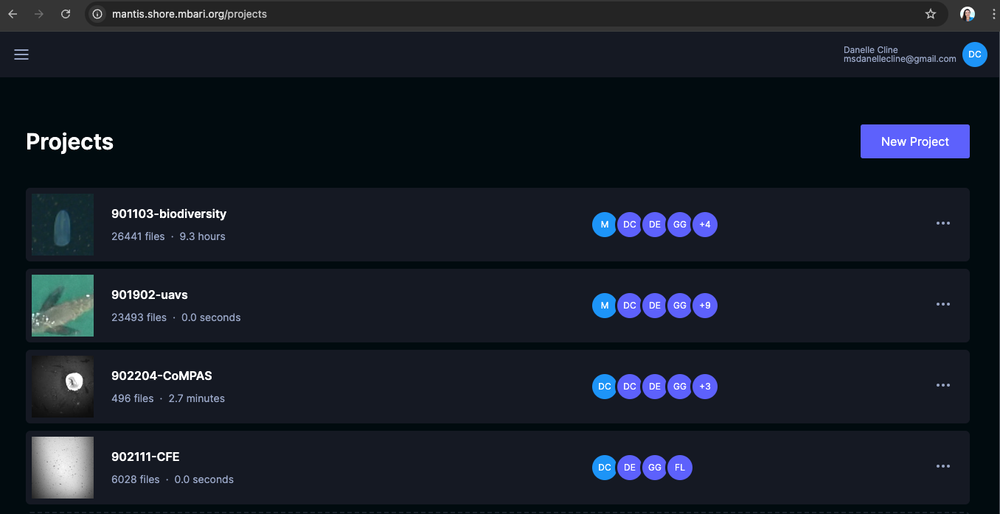

[](http://www.mbari.org) 
 
*aidata* is a command line tool to do basic extract, transform, load and download operations from
AI data for a number of projects at MBARI that require detection, clustering or classification.
This assumes that your project has been setup on the MBARI server [mantis](http://mantis.shore.mbari.org). 
Please contact one of the team members to get your project setup:
[Danelle](https://www.mbari.org/person/danelle-e-cline/).
[Duane](https://www.mbari.org/person/duane-edgington/).
[Fernanda](https://www.mbari.org/person/fernanda-lecaros-saavedra/).

The main requirement to use the tool is to have your media (image/video)  on a Atlas/Titan mount and
the user mldevops has read-only access to the data. 

Read only login with username `guest` and password `mbariguest`. 

!!! note
    *Only works on the MBARI network with a Chrome browser.*

[](http://mantis.shore.mbari.org)


## Installation 

### Create the Anaconda environment

The fastest way to get started is to use the Anaconda environment.  This will create a conda environment called *aidata*.
```shell
git clone http://github.com/mbari-org/aidata.git
cd aidata
conda env create 
conda activate aidata
export PYTHONPATH=$PWD
```

### Set your Tator token in an environment variable *or* pass it as an option with --token

```
export TATOR_TOKEN=15afoobaryouraccesstoken
```


## Commands

* `python aidata download --help` -  Download data, such as images, boxes, into various formats for machine learning e,g, COCO, CIFAR, or PASCAL VOC format
* `python aidata load --help` -  Load data, such as images, boxes, and exemplars into either a Postgres or REDIS database
* `python aidata db --help` -  Commands related to database management
* `aidata -h` - Print help message and exit.
 
Source code is available at [github.com/mbari-org/aidata](https://github.com/mbari-org/aidata/). 
